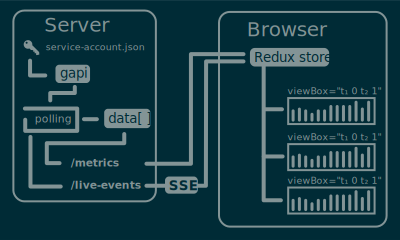
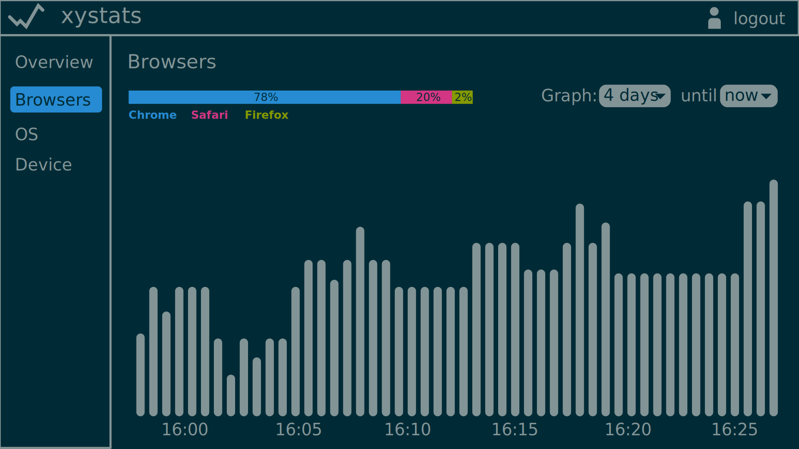

# xystats

A web app for viewing live Google Analytics data.

## Architecture

Server-sent events were chosen over alternatives like websockets or socket.io because SSE is well suited to this use-case, extremely easy to set up, and performs automatic re-connection.

## Graphing

The Google Analytics realtime API only allows retrieving a snapshot of current values, and so the server polls it at regular intervals, saving a timestamp each time. We can make no guarantees about the regularity of the polling or that there won't be discontinuities in the data due to variable network conditions, exceeding the API quota, API downtime etc. It's possible the values might not even be monotonic.

Nivo Bar only supports equally-distributed values along the x-axis (https://github.com/plouc/nivo/issues/225), and so it can't properly represent discontinuities or 'slop' in the polling interval. This is part of the motivation of a custom graph component.

There's a personal UX bugbear with the Google Analytics UI I wanted to address with this project: not being able to smoothly scroll/zoom the graphs. If the data you're interested in isn't fully visible the currently selected range, you need to:

- Individually pick out new start and end points in the calendar dropdowns,
- Apply the new range and wait for it to load,
- Reorient yourself with where your data now lies in the new graphs,
- Realize you went too far/not far enough with the new range,
- Repeat

With xystats I wanted the graphs to be smoothly scrollable and zoomable to any range with the cursor, thus eliminating this awkward UX loop. This is another motivation for a custom graph component: Nivo Bar doesn't have direct support for this. Although the data passed to a Nivo Bar component could be continuosly re-sliced to give the appearance of scrolling/zooming, it wouldn't be performant.

In addition, I'd like the graphs to smoothly scroll along as time progresses. It's easy to make an improvement over the Google Analytics UI which has some odd jumping-back-and-forth behavior on its Realtime overview page.

Hence there is a custom `Graph` component that achieves smooth scrolling/zooming and animation by efficiently mapping the entire dataset to a single SVG path, and rapidly adjusts the viewing range using the `viewBox` attribute.

It also implements a snapping behavior, whereby if the viewing range is scrolled all the way to the right, it will lock to 'now' and smoothly scroll along as new data arrives.

## Mockup

## TODO

- Share TypeScript types for the metrics between the server/client
- Graph ticks (time labels)
- Graph tooltips
- Show server-side errors and data discontinuities.
